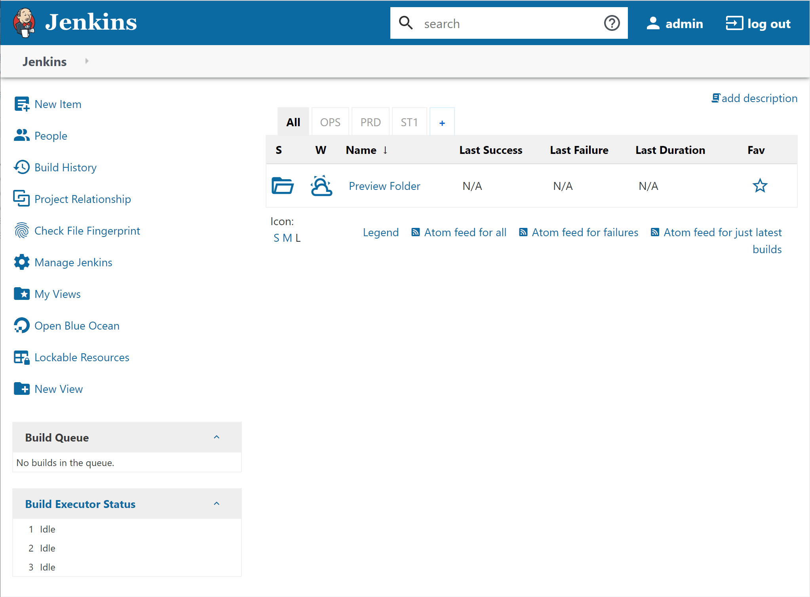
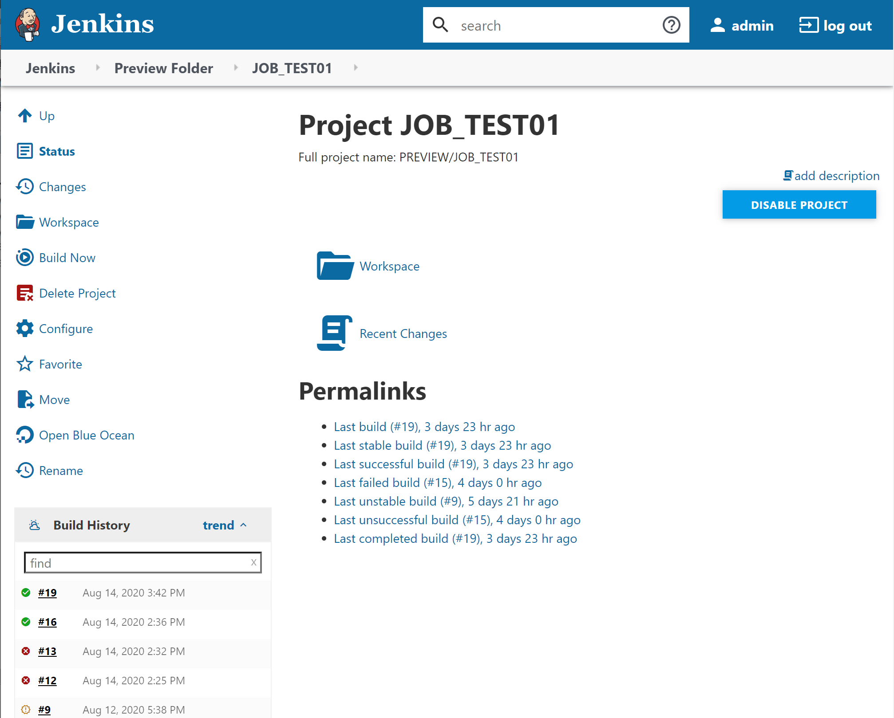
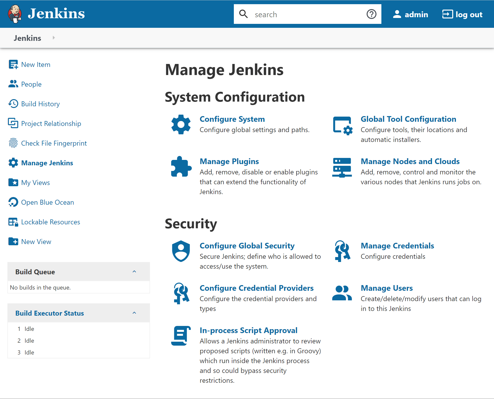

# jenkins-theme

Make jenkins looks better with Material Design Icon.

## Features

- Replace the old Tango Icon by [Material Design Icon](https://materialdesignicons.com "Material Design Icon")
- Remove all border radius
- Fix some vertical align(checkbox, icon, etc.)
- Material Design button style from [afonsof/jenkins-material-theme](https://github.com/afonsof/jenkins-material-theme)
- Syntax Highlight theme from [afonsof/jenkins-material-theme](https://github.com/afonsof/jenkins-material-theme)

## Screenshots

## Installation
### Use Online Resource
1. Install [Simple Theme Plugin](https://plugins.jenkins.io/simple-theme-plugin)
2. Click `Manage Jenkins`
3. Click `Configure System` and scroll down to `Theme`
4. Add a `Javascript URL` with value `https://cdn.rawgit.com/fthmko/jenkins-theme/userContent/theme.js`
5. Add a `CSS URL` with value `https://cdn.rawgit.com/fthmko/jenkins-theme/userContent/theme.css`
6. Add a `CSS URL` with value `https://cdn.jsdelivr.net/npm/@mdi/font@5.5.55/css/materialdesignicons.min.css`
7. `Save` and Refresh your browser

### Use Local Resource
1. Download this repo and upload files under `userContent` to your host's `$JENKINS_HOME/userContent`
2. Download [Material Design Icon](https://materialdesignicons.com "Material Design Icon") (version 5.5.5) and upload files to your host's `$JENKINS_HOME/userContent` 
3. Follow the previous method steps and change the URLs to your own
